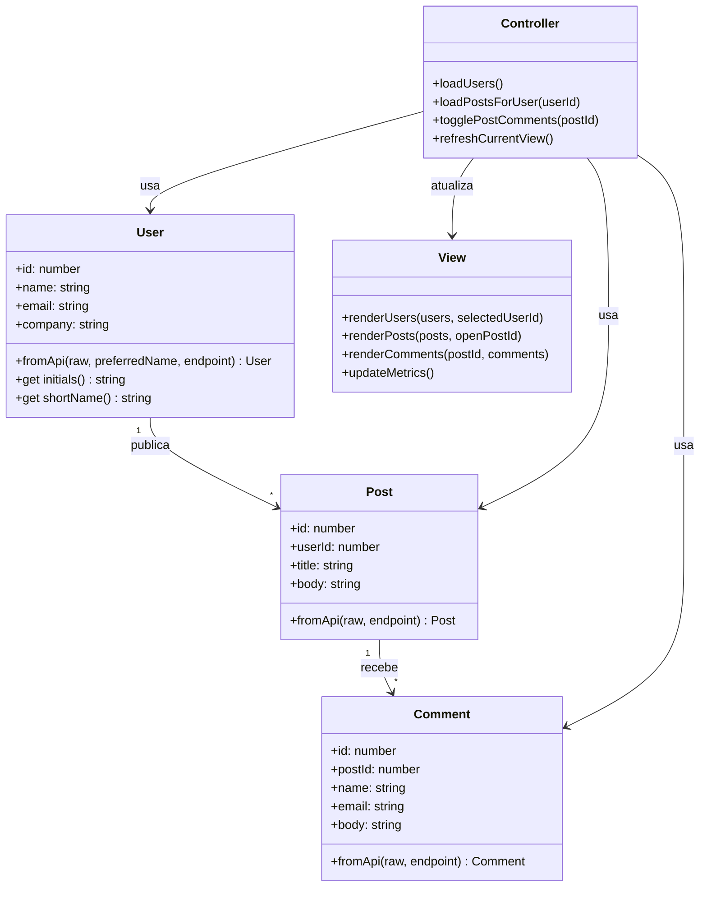

# Dashboard de Comunicacao Interna

## 1. Visao geral
Este projeto e um prototipo de um Dashboard de Comunicacao Interna para centralizar:
- perfis de colaboradores
- postagens
- comentarios

O objetivo e validar rapidamente a ideia do produto com arquitetura Cliente-Servidor, consumindo a API REST publica `JSONPlaceholder` em vez de construir um back-end proprio nesta etapa.

## 2. Escopo da atividade
O prototipo atende ao fluxo principal pedido no exercicio:
- listar usuarios
- selecionar um usuario
- carregar postagens relacionadas
- abrir comentarios de uma postagem
- exibir loading, tratamento de falhas e mensagens de erro

## 3. User Stories
1. Como funcionario, quero ver a lista de colaboradores para identificar rapidamente quem participa da plataforma.
2. Como funcionario, quero selecionar um colaborador e visualizar suas postagens para acompanhar atualizacoes internas.
3. Como funcionario, quero expandir uma postagem e ler os comentarios para entender o contexto da conversa.
4. Como usuario, quero feedback visual de carregamento para saber que o sistema esta buscando dados.
5. Como usuario, quero mensagens claras de erro quando a API estiver lenta, indisponivel ou retornar dados inconsistentes.

## 4. Requisitos nao funcionais
- Resiliencia de rede com timeout de 8 segundos por requisicao.
- Retry automatico para falhas transientes de timeout ou indisponibilidade.
- Tratamento de excecoes para falhas HTTP e falhas de rede.
- Validacao do contrato JSON antes de renderizar dados na interface.
- Interface responsiva para desktop e mobile.
- Feedback visual de loading e erro sem travar a aplicacao.

## 5. Endpoints consumidos
- `GET https://jsonplaceholder.typicode.com/users`
- `GET https://jsonplaceholder.typicode.com/posts?userId={id}`
- `GET https://jsonplaceholder.typicode.com/comments?postId={id}`

## 6. Arquitetura aplicada
### Cliente-Servidor
- Cliente: navegador executando a interface, o estado da aplicacao e a logica de consumo da API.
- Servidor: JSONPlaceholder fornecendo recursos REST em JSON.

### MVC no cliente
- Model: classes `User`, `Post` e `Comment`, mais os adaptadores `fromApi()` para validar o contrato da API.
- View: funcoes de renderizacao, loading, metricas, mensagens e painel de comentarios.
- Controller: orquestracao do estado, eventos, fluxo de selecao, abertura de comentarios e tratamento de falhas.

## 7. Modelagem estrutural
### Classes principais
- `User { id, name, email, company }`
- `Post { id, userId, title, body }`
- `Comment { id, postId, name, email, body }`

### Relacoes
- `User 1..* Post`
- `Post 1..* Comment`

### Diagrama de classes UML

## 8. Estrategias de resiliencia e riscos
### Falhas de rede
- Timeout com `AbortController` impede a aplicacao de ficar aguardando indefinidamente.
- Retry automatico reduz impacto de oscilacoes momentaneas.
- Erros `404` e `5xx` sao transformados em mensagens legiveis para o usuario.

### Mudanca de contrato da API
- O cliente valida se a resposta e um array quando espera colecoes.
- Os adaptadores `fromApi()` validam campos essenciais como `id`, `userId` e `postId`.
- Se a estrutura vier invalida, a interface bloqueia a renderizacao e mostra um erro de contrato, em vez de exibir dados corrompidos.

### UX de protecao
- Estados de loading deixam claro que a aplicacao esta processando dados.
- Banner de erro evita falha silenciosa.
- O painel de comentarios abre em sobreposicao e se reposiciona para manter legibilidade.

## 9. Funcionalidades implementadas
- Busca de usuarios por nome, email ou empresa.
- Selecao de usuario com atualizacao de metricas.
- Carregamento de posts por usuario.
- Abertura de comentarios por post.
- Cache em memoria para comentarios ja carregados.
- Botao de refresh para recarregar os dados.
- Fechamento do painel de comentarios com `Esc`.

## 10. Como executar
1. Abra o arquivo `index.html` no navegador.
2. Garanta conexao com a internet para acessar:
- Google Fonts
- JSONPlaceholder

## 11. Pitch resumido
- Valor do produto: centraliza comunicacao interna em uma unica interface simples.
- Viabilidade: reduz custo inicial ao reutilizar uma API REST publica durante a validacao do conceito.
- Arquitetura: Cliente-Servidor com MVC no cliente para separar integracao, apresentacao e fluxo.
- Riscos: timeout, indisponibilidade, erro HTTP e mudanca de contrato mitigados no cliente.

## 12. Entregaveis
- [x] Prototipo funcional integrado ao JSONPlaceholder
- [x] Documentacao de requisitos, arquitetura e UML
- [x] Material-base para apresentacao do pitch
