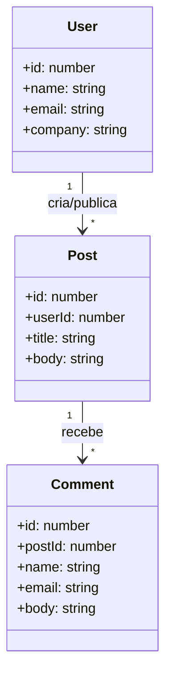

# Dashboard de Comunicação Interna (Protótipo)

## 1. O que é este projeto
Este projeto é um protótipo de **Dashboard de Comunicação Interna** para uma startup, desenvolvido para validar rapidamente a ideia do produto sem construir um back-end próprio.

A aplicação consome dados reais da API pública **JSONPlaceholder** e exibe:
- lista de usuários (colaboradores)
- postagens de cada usuário
- comentários de cada postagem

Tudo foi implementado em um único arquivo `index.html` com arquitetura **Cliente-Servidor** no front-end, organizada em **MVC (Model-View-Controller)**.

## 2. Contexto da atividade (faculdade)
A proposta da disciplina é simular um pré-projeto de Engenharia de Software, incluindo:
- levantamento de requisitos
- modelagem estrutural (UML)
- definição arquitetural
- tratamento de falhas de integração
- prototipagem rápida
- pitch defendendo viabilidade e riscos

Este repositório cobre esses pontos com foco em validação técnica e visual.

## 3. Tecnologias e recursos utilizados
- **HTML5**
- **CSS3** (tema escuro, layout responsivo com Grid/Flex, microinterações)
- **JavaScript (ES6+)**
- **Fetch API** para requisições HTTP `GET`
- **AbortController** para timeout de 8 segundos
- **JSONPlaceholder** (API REST fake para testes)
- **Google Fonts** (`Manrope` e `Space Grotesk`)

## 4. Endpoints consumidos
- `GET https://jsonplaceholder.typicode.com/users`
- `GET https://jsonplaceholder.typicode.com/posts?userId={id}`
- `GET https://jsonplaceholder.typicode.com/comments?postId={id}`

## 5. Histórias de Usuário (User Stories)
1. Como funcionário, quero ver a lista de colaboradores com dados básicos para identificar rapidamente quem está na plataforma.
2. Como funcionário, quero selecionar um colaborador e visualizar suas postagens para acompanhar atualizações internas.
3. Como funcionário, quero expandir uma postagem e ler seus comentários para entender o contexto das discussões.
4. Como usuário, quero feedback visual de carregamento para saber que o sistema está buscando dados.
5. Como usuário, quero mensagens claras de erro (timeout, API indisponível, 404) para entender quando houver falha de comunicação.

## 6. Requisitos não funcionais e restrições
- **Resiliência de rede:** timeout de 8s por requisição.
- **Tratamento de exceções:** `try/catch` em todas as chamadas.
- **Tratamento HTTP:** mensagens específicas para `404` e erros `5xx`.
- **UX mínima de confiabilidade:** estado de loading e erro visível na interface.
- **Responsividade:** interface adaptada para desktop e mobile.

## 7. Modelagem estrutural (UML)
Classes principais no cliente:
- `User { id, name, email, company }`
- `Post { id, userId, title, body }`
- `Comment { id, postId, name, email, body }`

Relações de multiplicidade:
- `User 1:* Post`
- `Post 1:* Comment`

### Diagrama de Classes (Mermaid)


## 8. Arquitetura aplicada
### Cliente-Servidor
- **Cliente (browser):** interface, lógica de interação e consumo da API.
- **Servidor externo:** JSONPlaceholder fornece recursos REST em JSON.

### MVC no front-end
- **Model:** funções assíncronas que chamam API (`fetch`) + classes de domínio (`User`, `Post`, `Comment`).
- **View:** funções puras de renderização e manipulação do DOM.
- **Controller:** orquestra fluxo, eventos de clique, estado global e tratamento de erros.

## 9. Estratégias de mitigação de falhas (gerenciamento de riscos)
- **Timeout (8s):** evita travamento quando a API demora.
- **API indisponível:** captura erro de rede e mostra aviso amigável.
- **Erro 404:** retorno de “recurso não encontrado”.
- **Erro 5xx:** retorno de “falha interna do servidor”.
- **Fallback visual:** loading + banner de erro para preservar a experiência do usuário.

## 10. Funcionalidades implementadas no protótipo
- Listagem de usuários em cards.
- Clique no usuário para carregar postagens relacionadas.
- Clique na postagem para expandir/ocultar comentários.
- Sidebar lateral e visual de dashboard corporativo.
- Layout responsivo com múltiplas colunas no desktop.
- Microinterações (hover, transições de expansão).

## 11. Como executar
1. Baixe/clone o repositório.
2. Abra o arquivo `index.html` no navegador.
3. Necessário internet para carregar:
- Google Fonts
- API JSONPlaceholder

## 12. Roteiro rápido para o Pitch (10-15 min)
1. **Visão do Produto:** centralizar comunicação interna (usuários, posts e comentários) em uma única interface.
2. **Viabilidade:** uso de API REST pública reduziu custo e tempo de desenvolvimento inicial.
3. **Arquitetura:** cliente-servidor + MVC separando dados, visual e controle.
4. **Riscos e respostas:** timeout, tratamento de exceções, mensagens de erro e camada de adaptação no cliente.

## 13. PRD / Prompt utilizado (para apresentar na disciplina)
```text
Desenvolver um protótipo de Dashboard de Comunicação Interna em um único index.html,
consumindo JSONPlaceholder (/users, /posts, /comments) via fetch GET. Organizar o código
em MVC no cliente: Model (requisições com try/catch, timeout de 8s com AbortController e
tratamento de HTTP 404/500), Controller (orquestração e estado) e View (renderização pura
no DOM). Funcionalidades: listar usuários, carregar posts por usuário, expandir comentários
por post, loading e erros visíveis. Design: tema escuro, sidebar corporativa, responsivo,
microinterações e tipografia moderna via Google Fonts.
```

## 14. Entregáveis da atividade
- [x] Código-fonte do protótipo integrado ao JSONPlaceholder (este repositório)
- [ ] Slides de apresentação do Pitch
- [x] PRD/Prompt utilizado para orientar o desenvolvimento

